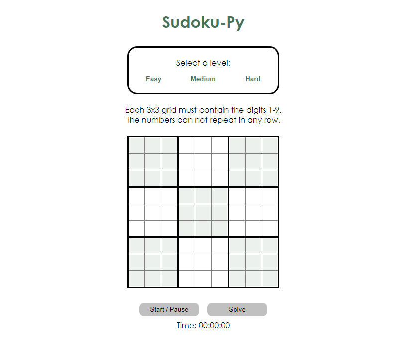

# SudokuPy
A Sudoku web app that utilizes a recursive backtracking algorithm to find the optimal solution for any unsolved puzzle.

    

---
## What is it?

---
## Table of contents
- [Purpose](#purpose)
- [Method](#method)
- [Installation](#installation)
- [Navigation](#navigation)
- [Reflection](#reflection)
- [Links](#links)

---
## Purpose

---
## Method

---
## Installation

---
## Navigation
Run the program from 'main.py'. In the terminal:  

---
## Reflection

---
## Links

